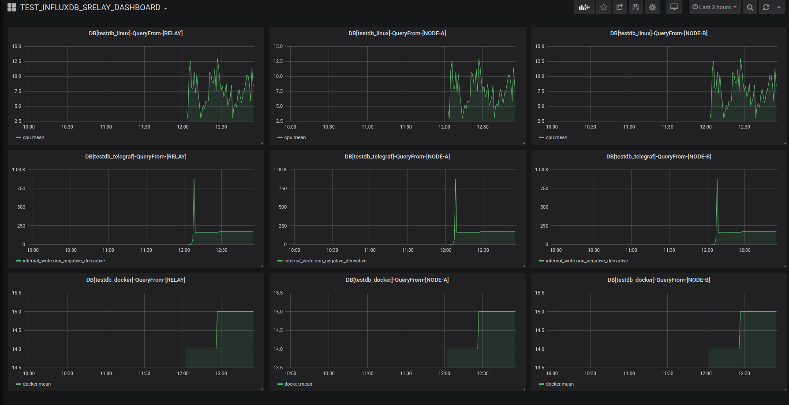

# Setup Testing environment

Telegraf sending metrics to 3 diferent databases;

* testdb_telegraf
* testdb_linux
* testdb_docker   


```
#build srelay  image from source

docker-compose build

# start relay and cluster nodes

docker-compose up -d relay influxdb-a influxdb-b

# check relay is up and running

curl -I  http://localhost:9096/ping

#check cluster is up and running

curl -I  http://localhost:9096/ping/cluster_linux

#check cluster extra healt info

curl   http://localhost:9096/health/cluster_linux

#create influxdb databases on all cluster nodes 

curl -i  -XPOST http://localhost:9096/admin/cluster_linux --data-urlencode "q=CREATE DATABASE testdb_telegraf"
curl -i  -XPOST http://localhost:9096/admin/cluster_linux --data-urlencode "q=CREATE DATABASE testdb_linux"
curl -i  -XPOST http://localhost:9096/admin/cluster_linux --data-urlencode "q=CREATE DATABASE testdb_docker"

# initialize telegraf and grafana also

docker-compose up -d 
```

# review data

testing env has an enbedded grafana with a review dashboad doing queries from relay and also from both influx nodes

http://localhost:3000/d/TEST_INFLUXDB_SRELAY_DASHBOARD/test_influxdb_srelay_dashboard




# develop ant test

Change your .env RELAY variable from `http://relay:9096` (relay inside docker), to `http://<YOUR_IP>:9096`.

Restart to route metrics to a localy started relay

```
docker-compose up -d
```
Start relay with bra (it will execute `.bra.toml` commands and will restart relay on each change)

```
bra run
```
